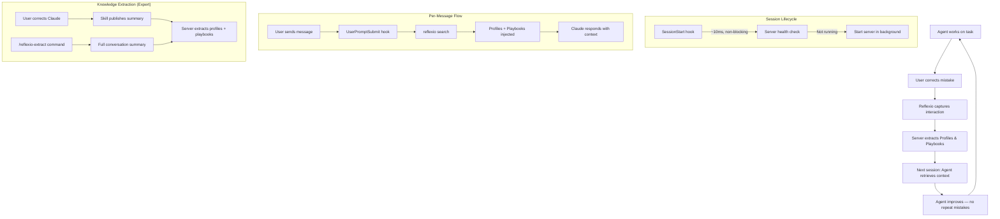

# Reflexio + Claude Code Integration

**Reflexio helps Claude Code remember what it learns about you and your projects across sessions.** It extracts two types of knowledge from your conversations:

- **User Profiles** — facts about you, your preferences, settings and environment shared by you (e.g. tools, project conventions, constraints)
- **User Playbooks** — behavioral rules for Claude, often derived from corrections but also from observing effective patterns.

In future sessions, Reflexio searches for relevant profiles and playbooks before Claude responds — so Claude adapts to your style and doesn't repeat mistakes.

> Part of the [Reflexio](../../../../README.md) open-source project. See also the [Python SDK docs](../../../client_dist/README.md).

## Table of Contents

- [How Reflexio Works](#how-reflexio-works)
- [Prerequisites](#prerequisites)
- [Install](#install)
- [Set Up Claude Code Integration](#set-up-claude-code-integration)
- [Uninstall](#uninstall)
- [How to Use: Normal Mode](#how-to-use-normal-mode)
- [How to Use: Expert Mode](#how-to-use-expert-mode)
- [Normal vs Expert: Which to Choose?](#normal-vs-expert-which-to-choose)
- [Monitoring & Troubleshooting](#monitoring--troubleshooting)
- [How It Works (Technical)](#how-it-works-technical)

## How Reflexio Works

### How it flows

0. **Server Start** — When Claude Code starts a session, the `SessionStart` hook checks if the Reflexio server is running. If not, it starts it in the background (~10ms, non-blocking). By the time you send your first message, the server is ready.
1. **Search** — Before Claude responds to your message, the `UserPromptSubmit` hook runs `reflexio search` with your message. Matching profiles and playbooks are injected as context Claude sees.
2. **Extract** — Knowledge is published to Reflexio in two ways (expert mode only):
  - **Automatic**: The expert skill detects when you interact with Claude and publishes a curated summary immediately in parallel
  - **Manual**: You run `/reflexio-extract` to have Claude summarize the full conversation (including reasoning, tool calls, etc) and publish it
   In both cases, the Reflexio server LLM analyzes the published summary and extracts profiles and playbooks automatically.
3. **Apply** — In future sessions, Claude finds the relevant profiles and playbooks via search and follows them.

## Prerequisites

- **Python >=3.12** (the `reflexio-ai` package requires `>=3.12` — see `pyproject.toml`)
- **Node.js** (for the search hook that runs on every user message)
- **An LLM API key** (e.g., `OPENAI_API_KEY`, `ANTHROPIC_API_KEY`) — only needed for **SQLite (local) mode**. Managed Reflexio and self-hosted servers handle extraction on their own — you only need the `REFLEXIO_API_KEY` for authentication.
- **Claude Code** installed and working

## Install

```bash
pip install reflexio-ai
```

This installs:

- The **Reflexio client** (Python library for interacting with the Reflexio server)
- The **Reflexio CLI** (built on top of the client — provides `reflexio search`, `reflexio publish`, `reflexio setup`, etc.)
- The **Reflexio server** (FastAPI backend that handles extraction and storage)
- The **Claude Code integration files** (skills, hooks, commands)

## Set Up Claude Code Integration

Run the setup wizard:

```bash
reflexio setup claude-code            # Normal mode (search-only)
# or
reflexio setup claude-code --expert   # Expert mode (search + publish + /reflexio-extract)
```

The setup wizard will:

1. Ask you where to install — **all projects** (`~/.claude/`) or **current project only** (`./.claude/`)
2. Ask you to choose a storage backend (SQLite is the default — no external database needed)
3. Ask you to choose an LLM provider and enter your API key — **only if using SQLite (local) storage**. If you chose Managed Reflexio or self-hosted, this step is skipped (the remote server handles extraction).
4. Configure `REFLEXIO_USER_ID=claude-code` for consistent user identification
5. Install the skill, rules, and search hooks into the chosen `.claude/` directory

You can also skip the interactive prompt with flags:

```bash
reflexio setup claude-code --global               # Install to ~/.claude/ (all projects)
reflexio setup claude-code --project-dir ./myapp   # Install to ./myapp/.claude/
```

### Which location?

| | All projects (`~/.claude/`) | Current project (`./.claude/`) |
|---|---|---|
| **Scope** | Every Claude Code session | Only this directory |
| **Best for** | Desktop app users, personal preferences | CLI users, team-shared config |
| **Hooks fire** | In all sessions | Only in this project |
| **Priority** | Lower — project-level overrides | Higher — overrides user-level |

If you have both user-level and project-level installs, Claude Code's priority rules apply: project-level skills, rules, and hooks take precedence over user-level ones.

### What gets installed

**Normal mode:**

- `.claude/skills/reflexio/SKILL.md` — the normal skill that teaches Claude to search Reflexio
- `.claude/rules/reflexio.md` — always-in-context rules for Reflexio behavior
- `.claude/settings.json` — adds `SessionStart` hook (auto-starts server) and `UserPromptSubmit` hook (runs `reflexio search` on every user message)

**Expert mode:**

- `.claude/skills/reflexio/SKILL.md` — the expert skill (different content from normal — includes instructions for publishing corrections and references `/reflexio-extract`)
- `.claude/rules/reflexio.md` — always-in-context rules for Reflexio behavior
- `.claude/commands/reflexio-extract/SKILL.md` — the `/reflexio-extract` slash command for manual extraction
- `.claude/settings.json` — same `SessionStart` + `UserPromptSubmit` hooks as normal mode

### Storage modes

**SQLite (local)** — default, no external setup needed:

- Reflexio server runs on your machine, auto-starts when Claude needs it
- Data stored at `~/.reflexio/data/reflexio.db`
- **Requires:** an LLM API key for the extraction pipeline
- No `REFLEXIO_API_KEY` needed

**Managed Reflexio** — connects to reflexio.ai:

- Endpoint: `https://reflexio.ai`
- Storage managed at [reflexio.ai/settings](https://www.reflexio.ai/settings)
- **Requires:** `REFLEXIO_API_KEY`
- No local LLM key or database needed — the managed server handles extraction and storage

**Self-hosted Reflexio** — connects to your own server:

- Endpoint: configurable (default `http://localhost:8081`)
- **Requires:** `REFLEXIO_API_KEY`
- No local LLM key or database needed — your server handles extraction and storage

## Uninstall

```bash
reflexio setup claude-code --uninstall
```

The uninstaller auto-detects where Reflexio is installed (user-level, project-level, or both) and asks which to remove. You can also target a specific location:

```bash
reflexio setup claude-code --uninstall --global               # Remove from ~/.claude/
reflexio setup claude-code --uninstall --project-dir ./myapp   # Remove from ./myapp/.claude/
```

This removes the skill, rules, commands, and hooks. Your extracted data in `~/.reflexio/` is preserved.

To fully remove Reflexio:

```bash
pip uninstall reflexio-ai
rm -rf ~/.reflexio/    # delete all data, configs, and logs
```

---

## How to Use: Normal Mode

Normal mode is search-only — Claude searches Reflexio on **every message** you send (not just the first one). You don't need to do anything special.

### Step 1: Start Claude Code

```bash
cd your-project/
claude
```

### Step 2: Work normally

Give Claude any task. On every message you send:

1. The `UserPromptSubmit` hook runs `reflexio search` with your message
2. If relevant profiles or playbooks are found, Claude sees them before responding
3. Claude adapts: follows playbook instructions, respects your preferences from profiles

**First session:** No profiles or playbooks exist yet — this is the "cold start". Claude works as usual. To build up knowledge, switch to expert mode (which can auto-publish corrections and provides the `/reflexio-extract` command).

### Step 3: Correct Claude when needed

When Claude does something wrong, correct it naturally:

> **You:** Write a Python function to calculate area.
>
> **Claude:** *(writes function without type hints)*
>
> **You:** No, always use type hints in this project.

In normal mode, these corrections are **not** automatically published to Reflexio. To build up your knowledge base, switch to expert mode.

---

## How to Use: Expert Mode

Expert mode adds the ability to publish knowledge to Reflexio — both automatically (when Claude detects corrections) and manually (via `/reflexio-extract`).

### Step 1: Start Claude Code

```bash
cd your-project/
claude
```

### Step 2: Work and correct Claude

Give Claude tasks and correct mistakes as they come up:

> **You:** Write a Python function called `calculate_area` that takes width and height. Put it in `geometry.py`
>
> **Claude:** *(writes function)*
>
> **You:** Now add `calculate_perimeter` and `calculate_diagonal`.
>
> **Claude:** *(writes more functions)*
>
> **You:** No, all functions must have type hints and Google-style docstrings. Fix all three.

The expert skill detects this correction and publishes it to Reflexio automatically. You'll see Claude run a `reflexio publish` command.

### Step 3: Use `/reflexio-extract` for comprehensive extraction

At any point, run:

```
/reflexio-extract
```

Claude will:

1. Review the full conversation — including reasoning, tool calls, dead ends, and corrections
2. Summarize key learnings into a structured format
3. Publish to Reflexio for profile and playbook extraction

This captures richer context than the automatic mid-session publish because Claude includes its chain-of-thought reasoning and intermediate steps.

### Step 4: Verify what was extracted

```bash
# Check playbooks (behavioral rules)
reflexio user-playbooks list --user-id claude-code

# Check profiles (facts about you and your environment)
reflexio user-profiles list --user-id claude-code

# Test search (what Claude sees before responding)
reflexio search "write a Python function"
```

Note: `reflexio search` uses the `REFLEXIO_USER_ID` from your `.env` (set to `claude-code` by the setup wizard), so you don't need to pass `--user-id` explicitly.

### Step 5: Next session — knowledge applied

```bash
claude
```

> **You:** Write a function called `convert_temperature` that takes celsius and returns fahrenheit. Put it in `utils.py`
>
> **Claude:** *(searches Reflexio, finds the type hints + docstrings playbook, writes function with both from the start)*

No correction needed — Claude remembered.

---

## Normal vs Expert: Which to Choose?


|                                 | Normal                                      | Expert                              |
| ------------------------------- | ------------------------------------------- | ----------------------------------- |
| **Search on every message**     | ✓ Automatic (hook)                          | ✓ Automatic (hook)                  |
| **Auto-publish corrections**    | ✗                                           | ✓ (skill detects corrections)       |
| `**/reflexio-extract` command** | ✗                                           | ✓ (user-invoked)                    |
| **Best for**                    | Consuming knowledge from an existing knowledge base | Building up your knowledge base     |
| **Complexity**                  | Zero — just use Claude normally             | Low — knowledge are auto-detected |


**Start with expert mode** if you're building knowledge from scratch. **Switch to normal mode** once you have a good knowledge base and just want to consume it.

---

## Monitoring & Troubleshooting

### Check server status

```bash
reflexio status check
```

### View server logs

```bash
cat ~/.reflexio/logs/server.log
```

### Query extracted data

```bash
# List playbooks
reflexio user-playbooks list --user-id claude-code

# List profiles
reflexio user-profiles list --user-id claude-code

# Search (what Claude sees on every message)
reflexio search "your task description" --user-id claude-code
```

### Query the SQLite database directly

```bash
# Count entities
sqlite3 ~/.reflexio/data/reflexio.db "
SELECT 'playbooks' as type, count(*) FROM user_playbooks
UNION ALL SELECT 'profiles', count(*) FROM profiles
UNION ALL SELECT 'interactions', count(*) FROM interactions;
"

# View playbook details
sqlite3 ~/.reflexio/data/reflexio.db "
SELECT content, structured_data FROM user_playbooks
ORDER BY user_playbook_id DESC LIMIT 5;
"
```

### Common issues


| Problem                       | Solution                                                          |
| ----------------------------- | ----------------------------------------------------------------- |
| `reflexio: command not found` | `pip install reflexio-ai`                                         |
| Search returns 0 results      | Cold start — no knowledge yet. Use expert mode to publish.        |
| Server not starting           | Check `~/.reflexio/logs/server.log`. Ensure LLM API key is set.   |
| Skill not loading             | Verify `.claude/skills/reflexio/SKILL.md` exists in your project. |
| Wrong user_id                 | Run `reflexio setup claude-code` to reconfigure.                  |


---

## How It Works (Technical)



### File structure

Integration files are installed to either `~/.claude/` (all projects) or `your-project/.claude/` (current project only). The layout is identical in both cases:

```
~/.claude/ or your-project/.claude/
├── settings.json                    ← Hook configuration (SessionStart + UserPromptSubmit)
├── skills/
│   └── reflexio/
│       ├── SKILL.md                 ← Normal or expert skill
│       └── .installed-by-reflexio   ← Marker for uninstall auto-detection
├── rules/
│   └── reflexio.md                  ← Always-in-context instructions
└── commands/                         ← Expert mode only
    └── reflexio-extract/
        └── SKILL.md                 ← /reflexio-extract command

~/.reflexio/
├── .env                                 ← API keys, REFLEXIO_USER_ID
├── data/
│   └── reflexio.db                      ← SQLite database
├── configs/
│   └── config_self-host-org.json        ← Server configuration
└── logs/
    └── server.log                       ← Server logs
```

