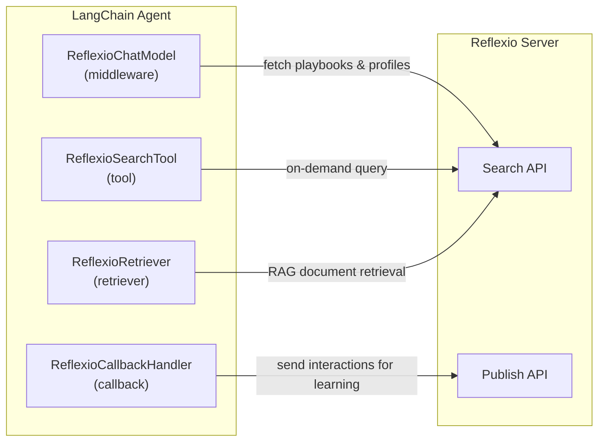

# Reflexio LangChain Integration

[Reflexio](../../../../README.md) is an open-source memory layer that helps AI agents learn from past interactions. It extracts behavioral playbooks and user profiles from conversations, then retrieves relevant context before each response -- so agents improve over time without retraining.

Connect LangChain agents to Reflexio for automatic self-improvement. Capture conversations, retrieve learned context, and inject behavioral guidelines — all through standard LangChain interfaces.

## Installation

```bash
pip install reflexio-client[langchain]
```

Requires `langchain-core >= 0.3.0`.

## Quick Start

```python
from langchain_openai import ChatOpenAI
from reflexio import ReflexioClient
from reflexio.integrations.langchain import ReflexioCallbackHandler, ReflexioChatModel

client = ReflexioClient(url_endpoint="http://localhost:8081/")

# Option 1: Callback — capture conversations and publish to Reflexio
handler = ReflexioCallbackHandler(client, user_id="user_123", agent_version="v1")
llm = ChatOpenAI(model="gpt-5-mini")
llm.invoke("Hello!", config={"callbacks": [handler]})

# Option 2: Middleware — auto-inject Reflexio context before every LLM call
reflexio_llm = ReflexioChatModel(
    llm=ChatOpenAI(model="gpt-5-mini"),
    client=client,
    agent_version="v1",
    user_id="user_123",
)
reflexio_llm.invoke("How should I handle this request?")
```

## Components

### ReflexioCallbackHandler

Captures user messages, LLM responses, and tool calls during a chain/agent run, then publishes the full conversation to Reflexio when the outermost chain completes.

```python
from reflexio.integrations.langchain import ReflexioCallbackHandler

handler = ReflexioCallbackHandler(
    client=client,
    user_id="user_123",
    agent_version="v1",
    session_id="session_abc",  # optional, groups related requests
    source="support-bot",      # optional, identifies the calling system
)
chain.invoke({"input": "..."}, config={"callbacks": [handler]})
```

**Behavior:**
- Buffers interactions per root chain run — no data is sent mid-conversation
- Deduplicates user messages that appear in multiple LLM calls (common with agent loops)
- Publishes fire-and-forget on chain completion or error
- Supports concurrent root runs without cross-contamination

### ReflexioChatModel

Wraps any LangChain `BaseChatModel` to automatically search Reflexio and inject relevant playbooks and user profiles as a system message before each LLM call.

```python
from reflexio.integrations.langchain import ReflexioChatModel

reflexio_llm = ReflexioChatModel(
    llm=ChatOpenAI(model="gpt-5-mini"),
    client=client,
    agent_version="v1",
    user_id="user_alice",
    top_k=5,  # max results per entity type
)

# Drop-in replacement — works with LCEL, AgentExecutor, LangGraph, etc.
response = reflexio_llm.invoke("How should I handle password resets?")
```

**Features:**
- Supports sync, async, and streaming
- Compatible with `bind_tools()` and `with_structured_output()`
- Context is injected as a `SystemMessage` before the last user message

### ReflexioRetriever

Standard LangChain retriever backed by Reflexio search. Returns results as `Document` objects for use in RAG chains.

```python
from reflexio.integrations.langchain import ReflexioRetriever

retriever = ReflexioRetriever(
    client=client,
    agent_version="v1",
    search_type="unified",  # "unified", "feedbacks" (agent playbooks), or "profiles"
    top_k=5,
)
docs = retriever.invoke("How to handle refund requests?")
```

Each document includes metadata with `type` (`feedback` for agent playbook, `raw_feedback` for user playbook, or `profile`) and entity-specific fields.

### ReflexioSearchTool

A LangChain tool that lets agents query Reflexio mid-conversation for relevant guidance.

```python
from reflexio.integrations.langchain import ReflexioSearchTool

tool = ReflexioSearchTool(
    client=client,
    agent_version="v1",
    user_id="user_alice",
)

# Add to any agent's tool list
from langchain.agents import create_react_agent
agent = create_react_agent(llm, [tool, ...other_tools], prompt)
```

### get_reflexio_context

Low-level prompt helper that searches Reflexio and returns formatted text. No LangChain dependency — works with plain strings.

```python
from reflexio.integrations.langchain import get_reflexio_context

context = get_reflexio_context(
    client,
    query="password reset policy",
    agent_version="v1",
    user_id="user_alice",
    top_k=5,
)
# Returns formatted sections: Behavioral Guidelines, User Context
```

## Combining Components

Use the callback handler and middleware together for a full learning loop:

```python
from reflexio.integrations.langchain import ReflexioCallbackHandler, ReflexioChatModel

# Middleware injects learned context into every LLM call
reflexio_llm = ReflexioChatModel(llm=base_llm, client=client, agent_version="v1")

# Callback captures conversations so Reflexio can learn from them
handler = ReflexioCallbackHandler(client=client, user_id="user_123", agent_version="v1")

# The agent improves over time: past interactions inform future responses
agent.invoke(
    {"input": "..."},
    config={"callbacks": [handler]},
)
```

## Architecture



All LangChain-dependent classes are lazy-imported. The module loads without `langchain-core` installed — an `ImportError` with install instructions is raised only when a LangChain class is accessed.

## Further Reading

- [Reflexio main README](../../../../README.md)
- [Python SDK documentation](../../../client_dist/README.md)
