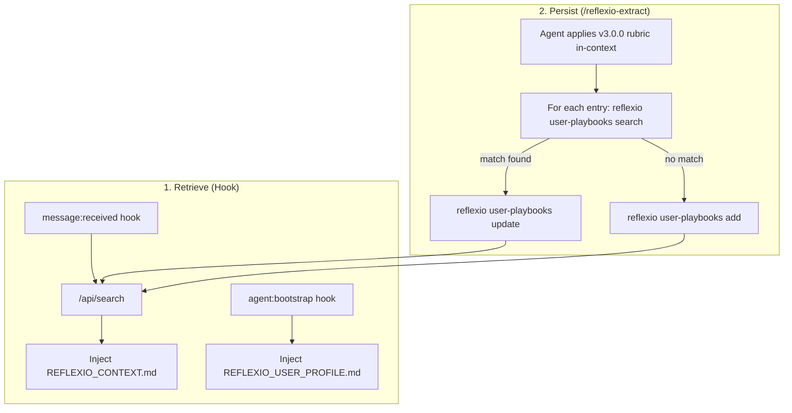

# Reflexio OpenClaw Integration

Connect [OpenClaw](https://openclaw.ai) agents to [Reflexio](https://github.com/reflexio-ai/reflexio) for cross-session memory. Past-session playbooks are retrieved and injected automatically before each response; new learnings are persisted when the agent runs `/reflexio-extract`, which applies the extraction rubric in its own context and writes playbooks to Reflexio via direct CRUD. **No LLM provider API key is required on the Reflexio server side** — extraction happens in the agent's own session, so OpenClaw's setup stays minimal.

## Table of Contents

- [How It Works](#how-it-works)
- [Multi-User Architecture](#multi-user-architecture)
- [Prerequisites](#prerequisites)
- [Installation](#installation)
- [Configuration](#configuration)
- [What to Expect](#what-to-expect)
- [File Structure](#file-structure)
- [Manual Testing](#manual-testing)
- [Comparison with Claude Code / LangChain Integrations](#comparison-with-claude-code--langchain-integrations)

## How It Works



The integration has two independent mechanisms:

### 1. Retrieve (Hook — automatic, runs every session)

```
Per-message (message:received hook)
  └── POST /api/search with user's message
      └── Returns matching user + agent playbooks + profiles
      └── Injects REFLEXIO_CONTEXT.md as a bootstrap file

Session start (agent:bootstrap hook)
  └── POST /api/search with a profile-shaped query
      └── If profiles exist, injects REFLEXIO_USER_PROFILE.md
```

The hook never buffers conversations and never POSTs to `/api/publish_interaction`. It is strictly a read path into the local Reflexio store.

### 2. Persist (`/reflexio-extract` — agent-driven)

```
User runs /reflexio-extract
  └── Agent applies the v3.0.0 extraction rubric to its current conversation
      └── Produces a list of playbook entries (Correction SOPs + Success Path Recipes)
      └── For each entry:
          ├── reflexio user-playbooks search "<trigger>" --agent-version openclaw-agent
          ├── If a close match exists → reflexio user-playbooks update --playbook-id <id> --content "<merged>"
          └── Otherwise → reflexio user-playbooks add --agent-version openclaw-agent ...
```

Because the agent itself performs extraction (using its own LLM — i.e. whatever provider OpenClaw is running on top of), the Reflexio server never needs to call an external LLM for this integration. That's what makes the setup LLM-key-free.

## Multi-User Architecture

Each OpenClaw agent (identified by its `agentId`) is treated as a distinct Reflexio user. This enables per-agent learning isolation:

```
~/.openclaw/
├── agents/
│   ├── main/        → Reflexio user_id: "main"
│   ├── work/        → Reflexio user_id: "work"
│   └── ops/         → Reflexio user_id: "ops"
```

- **User playbooks**: per-agent corrections and recipes, isolated by `agentId`. Mistakes made by `main` are tracked separately from mistakes made by `work`.
- **`user_id`** is derived from the OpenClaw session key prefix (`agent:<id>:...`). There is no override — the hook is deliberately locked to sessionKey-derived identity to eliminate env-var reads.

This integration does not aggregate user playbooks across instances. Cross-instance sharing requires a server-side LLM clustering pass, which was intentionally dropped to keep the integration free of LLM-provider dependencies. Teams that want shared agent playbooks across instances can use managed Reflexio or the Claude Code integration, which still run server-side aggregation.

## Prerequisites

- [OpenClaw](https://openclaw.ai) installed and running
- The `reflexio` CLI on PATH: `pipx install reflexio-ai` (or `pip install --user reflexio-ai`)
- The local Reflexio server running at `127.0.0.1:8081`

**No LLM provider API key is required.** The Reflexio server only performs CRUD + semantic search for this integration; playbook extraction runs in the agent's own session when the user invokes `/reflexio-extract`.

> Run `reflexio setup openclaw` to automate storage configuration and hook/skill/command installation.

## Installation

### Option 1 — ClawHub (recommended)

```bash
clawhub skill install reflexio
```

On first use, the skill auto-installs the `reflexio-ai` CLI (via `pipx` or `pip`) and runs `reflexio setup openclaw` to activate the hook, slash commands, and workspace rule.

### Option 2 — Automated setup (if you already have `reflexio-ai` installed)

```bash
pip install reflexio-ai
reflexio setup openclaw
```

This installs the hook, copies the skill and commands to `~/.openclaw/skills/`, and drops the workspace rule into `~/.openclaw/workspace/`.

### Option 3 — Manual (for developing against source)

```bash
# Hook: search-only retrieval
openclaw hooks install /path/to/reflexio/integrations/openclaw/hook --link
openclaw hooks enable reflexio-context
openclaw gateway restart
openclaw hooks list  # expect: ✓ ready │ 🧠 reflexio-context

# Skill: teaches agent when/how to use reflexio CLI
cp -r /path/to/openclaw/skill ~/.openclaw/skills/reflexio

# Command: extract and upsert playbooks from the current conversation
cp -r /path/to/openclaw/commands/reflexio-extract ~/.openclaw/skills/reflexio-extract

# Rule: always-active behavioral constraints — loaded every session
cp /path/to/openclaw/rules/reflexio.md ~/.openclaw/workspace/reflexio.md
```

The rule ensures the agent follows injected Reflexio context, runs manual search fallback when the hook doesn't fire, and enforces behavioral conventions (transparency, non-blocking, silent infrastructure).

## Configuration

This integration is **localhost-only**. The hook hard-codes the Reflexio
server URL to `http://127.0.0.1:8081` and reads no environment variables —
it cannot be reconfigured to send data off-host. The agent label is hardcoded
to `openclaw-agent` and the per-agent user ID is derived from OpenClaw's
session key (`agent:<id>:...` prefix), with a fallback of `openclaw`.

If you need remote Reflexio (managed or self-hosted) from OpenClaw, use the
Claude Code integration instead — it supports a full set of env vars for
pointing at external servers.

## What to Expect

**Session 1 (cold start):** No playbooks exist yet. The agent works normally. If the user corrects the agent or the agent completes substantive domain work, the agent runs `/reflexio-extract` to extract playbooks and write them to Reflexio.

**Session 2+:** Before each task, the `message:received` hook runs a search and injects matching playbooks as `REFLEXIO_CONTEXT.md`. The agent can also run `reflexio search "<task>"` manually. Over time:

- Mistakes made once are not repeated (corrections match by trigger similarity)
- User preferences are remembered (profiles injected at session bootstrap)
- The agent adapts its approach per-task based on accumulated playbooks
- Successful recipes get replayed when a similar task comes up

**The learning loop:**

1. Agent works on a task → user corrects a mistake (or agent completes a substantive recipe)
2. Agent runs `/reflexio-extract` → applies the v3.0.0 rubric → searches for a close match → updates existing playbook or adds a new one
3. Next session, similar task → `message:received` hook injects the playbook → agent applies the rule
4. Mistake not repeated

## File Structure

```
openclaw/
├── README.md               ← This file
├── hook/                   ← Search-only: inject past-session playbooks before each response
│   ├── handler.js          ← Event handlers: agent:bootstrap, message:received
│   ├── HOOK.md             ← Hook metadata (events, requirements)
│   └── package.json        ← npm package manifest
├── skill/                  ← On-demand: search for task-specific playbooks + extract flow
│   └── SKILL.md            ← Teaches agent when/how to search and when to run /reflexio-extract
├── rules/                  ← Always-active: behavioral constraints loaded every session
│   └── reflexio.md         ← Follow injected context, manual search fallback, transparency
└── commands/               ← OpenClaw slash commands
    └── reflexio-extract/   ← /reflexio-extract: apply v3.0.0 rubric, search, upsert playbooks
```

## Manual Testing

See [TESTING.md](TESTING.md) for a step-by-step guide to manually test the integration end-to-end — from install through search, retrieval, extraction + upsert, multi-user isolation, graceful degradation, and uninstall.

## Comparison with Claude Code / LangChain Integrations


| Aspect               | OpenClaw                                            | Claude Code                                    | LangChain                               |
| -------------------- | --------------------------------------------------- | ---------------------------------------------- | --------------------------------------- |
| Integration method   | CLI commands + hooks                                | CLI commands + hooks                           | Python SDK + callbacks                  |
| Context retrieval    | Per-message (hook) + per-task (skill)               | Per-task via skill                             | Per-LLM-call via middleware (automatic) |
| Conversation capture | None — `/reflexio-extract` performs in-context extraction | Hook buffers → SQLite → flushes at session end | Callback captures per chain run         |
| Extraction          | Agent-driven (v3.0.0 rubric in-context) + direct CRUD | Server-side LLM extraction                     | Server-side LLM extraction              |
| Multi-user support   | Yes — per-agentId user isolation                    | Yes — per-agent user isolation                 | Single user per client instance         |
| Agent playbooks      | Read-only (no aggregation in this integration)      | Yes — aggregated across all instances          | Not yet                                 |
| Agent teaching       | SKILL.md (natural language)                         | SKILL.md (natural language)                    | Tool definition (structured)            |
| Server dependencies  | `reflexio` CLI; **no LLM provider key required**    | `reflexio` CLI + LLM provider key              | `langchain-core >= 0.3.0`               |


All integrations connect to the same Reflexio server and share the same playbook/profile data. Playbooks written by OpenClaw (via `/reflexio-extract`) are visible to Claude Code and LangChain agents and vice versa, as long as they use the same `--agent-version` tag. Only integrations that run server-side LLM aggregation produce new agent playbooks, though — the OpenClaw integration is read-only for that layer.

## Further Reading

- [Reflexio main README](../../../../README.md)
- [Python SDK documentation](../../../client_dist/README.md)

